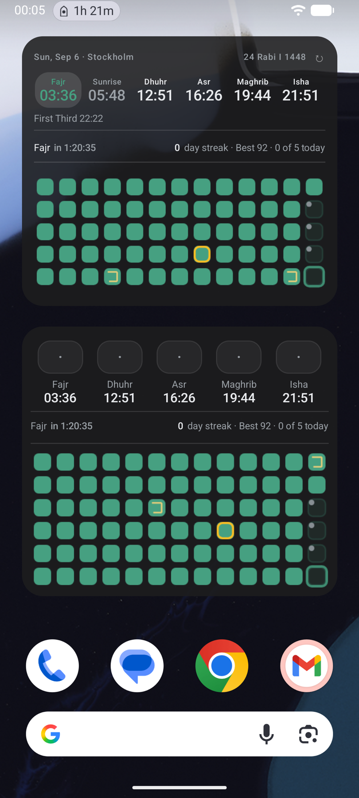

<div align="center">
  <a href="https://github.com/Safouene1/support-palestine-banner/blob/master/Markdown-pages/Support.md"></a>
</div>

<div align="center">
  

  A calm, private, offline-first companion for the day's intentions. Prayer times and a qibla compass, the Madinah muṣḥaf in four riwāyāt with recitation and tafsir, Tilāwah for listening surah into surah with the screen off, dua and tasbih, a fasting and prayer journal, home-screen widgets on three platforms, and sync between your own devices with no account and no server — no ads, no analytics, no tracking.

  **[mihrab website →](https://mihrab.elghamri.se/)**

  <br>

  <a href="https://apps.apple.com/us/app/prayer-salah-times-qibla/id6762085256"></a>
  <a href="https://play.google.com/store/apps/details?id=com.prayer_times"></a>
  <a href="https://f-droid.org/packages/com.prayer_times/"></a>
  <a href="https://github.com/Hassan-PS/Mihrab/releases"></a>
  <a href="https://apps.obtainium.imranr.dev/redirect?r=obtainium://app/%7B%22id%22%3A%22com.prayer_times%22%2C%22url%22%3A%22https%3A%2F%2Fgithub.com%2FHassan-PS%2FMihrab%22%2C%22author%22%3A%22Hassan-PS%22%2C%22name%22%3A%22Mihrab%22%7D"></a>

</div>

---

## Screenshots

<div align="center">

&nbsp;&nbsp;

&nbsp;&nbsp;

&nbsp;&nbsp;

</div>

---

## Features

### Prayer

- **Prayer times, online or off** — Daily times and a full month view up to a year ahead. Cached on-device so the app opens instantly without a connection; falls back to on-device calculation when the network is away.
- **Adhan & reminders** — 17 built-in adhan recordings (or import your own), a pre-prayer reminder window, and exact-alarm scheduling so the adhan lands on time even under aggressive battery managers.
- **Sources, including national ones** — AlAdhan, PrayTimes.dev, on-device calculation (Adhan JS), or a published national table: **Sweden** (Islamiska Förbundet) and **Morocco** (the Ministry of Habous and Islamic Affairs), rebuilt daily by a workflow in this repo and matched to your nearest listed city. "Automatic" picks the right one for where you are.
- **Tuned to your mosque** — Per-prayer minute offsets, Hanafi or standard Asr, and the extra marks when you want them: sunrise, Islamic midnight, the last third of the night, and the first third after Isha.
- **Maliki second times** — Off by default: turn them on and each prayer gains a line saying when its preferred time (*ikhtiyārī*) closes and its late time (*ḍarūrī*) begins, computed on your device from your coordinates whichever source the times come from. From *Al-Murshid al-Muʿīn* (Ibn ʿĀshir). Fajr's and Asr's boundaries are marked approximate, and where the sun never reaches the angle nothing is shown rather than a guess.
- **Qibla compass** — A live dial with signal strength, a hold-still prompt when the sensors need it, and a cross-check against the sun. Falls back to the bearing when the phone has no magnetometer.
- **Saved locations** — Keep the places you check on and switch between them freely; automatic location and saved places are not alternatives, and the month sheet names the city rather than printing coordinates.
- **A month you can hand over** — The whole month as a sheet, Hijri and Gregorian side by side, exportable as an image or a PDF in any of the app's languages, with a QR back to the app.
- **Live Activity** — A pinned countdown to the next prayer: Android 16+ status-bar chip and always-on notification in three designs (countdown, timeline, or markers with a proportional bar for the next three events), iOS Lock Screen and Dynamic Island via ActivityKit. What it shows — Hijri date, location, sunrise, the lock-screen button — is yours to switch.
- **Home-screen widgets** — Prayer times in three sizes, plus Log Today (with the practice graph and a countdown), Hijri date, streak, tasbih and reading widgets, on iOS, Android **and** the Mac. Per-prayer accents, dynamic colour, adjustable background opacity.

### Quran

- **Interactive Madinah mushaf** — All 604 pages, drawn as *text* from the official KFGQPC page fonts rather than as page images: sharp at any zoom, instant to rotate, and a fraction of the memory. Reading starts the moment the download does — pages arrive as their fonts do (~300 KB each) with a slim line saying how the rest is going. Paper, sepia or night; a page rail and a go-to-page jump; fullscreen from the margins.
- **A facing-page spread on iPad and Mac** — the pair of pages is the thing that turns, with the keyboard and a surah sidebar.
- **Four riwāyāt** — Ḥafṣ from the KFGQPC page fonts, and Warsh, Qālūn and Shuʿbah as bundled-typeface muṣḥafs downloaded on request from Quranpedia. Your place carries across a switch: the ayah is the coordinate, not the page number.
- **Everything in one panel** — A tap on a word opens its ayah: translation, real **tafsir** (Ibn Kathir, Maarif-ul-Quran, al-Muyassar and more — cached for offline), coloured bookmarks, star, share as text or a rendered image card, the khatmah position, and the full recitation controls.
- **42 reciters** — Al-Husary, Alafasy, Abdul Basit, Al-Minshawi, As-Sudais, Ash-Shatri, Ahmed Al-Ajmi, Yasser Ad-Dossari, Maher Al-Muaiqly, Saad Al-Ghamdi, plus mujawwad readings from Abdul Basit, Al-Minshawi and Al-Husary, streamed per-ayah or downloaded per-surah for offline listening. **Word-level highlight on the page itself** for nine of them — and in landscape the column follows the reciter down the page; prefetching keeps long sessions gapless.
- **Tilāwah — listening, as its own page** — The reader plays the passage in front of you and stops where that surah does. Tilāwah is the other act: pick a reciter, start anywhere, and it runs surah into surah with the screen off, from the lock screen, without the app open or even alive. Scrub by ayah or by whole surah, shuffle, set a speed or a sleep timer (minutes, or the end of the surah), and follow along on a live muṣḥaf page with the recited word lit. Its downloads share the reader's own folder, so a reciter fetched for a flight makes play-from-here work offline in the same act. While anything is playing a **mini-player** sits under the title bar on every screen: what it is, a progress bar for the surah, pause, and a way back to Tilāwah.
- **Memorization (hifz) tools** — Repeat each ayah ×N, repeat a range ×M, pause-between-repeats for recite-back, and hide-and-reveal masking of Arabic or translation.
- **Khatmah plans** — 30/60/90-day plans (or your own length, from the page you are on) with automatic page tracking, a continue button, pin-your-exact-ayah positioning, a done button for the day, flexible resets, and an optional daily reminder with today's portion.
- **13 translation editions** — Sahih International, Pickthall, Bernström, Hamidullah, Diyanet, Cortés, Bubenheim, Ma Jian, Kuliev, Indonesian Ministry, Mujibur Rahman, Jalandhry, Suhel Farooq Khan — with diacritic-insensitive Arabic + translation search, and a verse-by-verse reading view that lights the recited word too.
- **Ayah of the day** — On the Quran page, and optionally as a daily notification at a time you choose, with its translation.
- **Manage downloads** — Exactly what is on disk — muṣḥaf pages, riwāyāt, tafsir, recitation audio — with sizes, and a way to remove any of it.

### Daily worship

- **Dua library** — 100+ duas across 19 categories (morning, evening, after prayer, food, sleep, travel, distress, gratitude, protection, and more) with Arabic, transliteration, translation, and Hisn al-Muslim sources.
- **Tasbih counter** — Tap-to-count for the post-prayer dhikr plus open-ended Astaghfirullah and Salah on the Prophet ﷺ. Tabular numerals so digits don't shimmer on tick.
- **Fasting log** — Tracks Ramadan + voluntary Sunnah fasts (Mondays, Thursdays, Ayyam al-Bidh, Arafah, Ashura, Six of Shawwal) with day-before reminders. Encrypted on-device.
- **Prayer journal** — Log each prayer as on-time / late / missed / qadha with private notes, a practice graph, streaks and what is owed. Optional "Log prayer" action right on the prayer notification, an end-of-day nudge, and tools to backfill or fill whole months at once.
- **Hijri calendar** — Throughout, with Ramadan, Eid and Jumuʿah treatments and a Ramadan countdown on Home.

### Yours, and only yours

- **Sync between your own devices** — Pair by scanning a QR code (or copying it), and your journal, streaks, fasts, notes and settings stay in step. No account, no server of ours: the devices write **sealed** files into a folder you already keep in sync — Syncthing, Nextcloud, whatever you use — and each device holds a key that never leaves it, so what passes through that folder is unreadable to anything but the devices you paired. Choose how often it runs: on open, every 15 minutes, hourly, daily, or never.
- **Backup and restore** — Export everything as a file you keep, and import it back, on any platform.
- **Your data survives reinstalls** — Settings, journal, bookmarks and khatmah ride Android Auto Backup and device-to-device transfer; large re-downloadable content stays out of your backup quota.
- **Privacy by design** — No ads, no analytics, no tracking, no account. Coordinates and prayer history are encrypted on-device; nothing is shipped off your phone that you did not ask to send.

### The app itself

- **Yours to look at** — Light, dark or system, pure-black for OLED, six accent colours or your own hex, and the platform's own palette when you want it: **Material You** on Android, **Liquid Glass** on iOS.
- **Real Arabic typography** — Amiri Quran for ayah text with correct stacked diacritics, Amiri Naskh for duas, on both platforms.
- **13 languages** — English, Arabic, Swedish, Bengali, Urdu, Hindi, French, Spanish, German, Turkish, Indonesian, Russian, and Chinese — every screen, every notification, every dua title, and the widgets too. Arabic and Urdu are fully RTL.
- **A Mac app, not a phone app in a window** — The Catalyst build has the spread reader, keyboard paging, the surah sidebar and its own widgets in Notification Centre.
- **It tells you what it is doing** — A data-statistics panel names the source in use, when each dataset was last rebuilt, how far ahead it reaches, and when the next check is due.
- **Open source** — AGPL-3.0-or-later. Anyone who ships a fork, or runs it as a service, must publish their source too. The F-Droid flavor ships without Google Play Services. There are no in-app purchases in any build.

---

## Install

| Platform | Link |
|---|---|
| **iOS** | [App Store](https://apps.apple.com/us/app/prayer-salah-times-qibla/id6762085256) |
| **macOS (Homebrew)** | `brew install --cask hassan-ps/tap/mihrab` — native Mac Catalyst build from [GitHub Releases](https://github.com/Hassan-PS/Mihrab/releases) |
| **Android APK** | [GitHub Releases](https://github.com/Hassan-PS/Mihrab/releases) → `app-fdroid-release.apk` (arm64) |
| **Android (Obtainium)** | [Add to Obtainium](https://apps.obtainium.imranr.dev/redirect?r=obtainium://add/https://github.com/Hassan-PS/Mihrab) — auto-updates directly from GitHub Releases |
| **Google Play** | [Google Play](https://play.google.com/store/apps/details?id=com.prayer_times) |
| **F-Droid** | [f-droid.org/packages/com.prayer_times](https://f-droid.org/packages/com.prayer_times/) |

---

## Build

```sh
npm install
npm start
```

### Android

```sh
# F-Droid APK (no Google Play Services)
npm run android:assembleFdroidRelease

# Google Play AAB
npm run android:bundlePlayRelease
```

Outputs:
- F-Droid APK: `android/app/build/outputs/apk/fdroid/release/app-fdroid-release.apk`
- Play AAB: `android/app/build/outputs/bundle/playRelease/app-play-release.aab`

### iOS

```sh
npm run ios
```

Archive and upload via Xcode Organizer for App Store / TestFlight.

### Tests

```sh
npx jest        # 2,900+ unit tests
npm run e2e     # Maestro end-to-end flows (needs a running emulator/simulator)
```

---

## Supporting the project

**Mihrab does not take money.** There is no donation link, no sponsorship, no
in-app purchase and no tip jar — the billing library was removed from the
project outright, and no build pulls one back in. Several people have kindly
offered; the answer is the same to everyone. It is not that kind of project,
and it is not going to become one.

Three kinds of support are welcome, and they are worth more:

- **Dua** — for me and my parents, and for everyone whose work this is built on.
- **Constructive feedback** — a prayer time that disagrees with your masjid, a
  translation that reads wrong, a screen that fights you. Say what you saw and
  what you expected in [an issue](https://github.com/Hassan-PS/Mihrab/issues);
  that is how the bugs get found.
- **Code** — pull requests, translations, and reproducible bug reports. The
  build instructions are above and the whole thing is AGPL.

If you were going to send something, send it to your local masjid or to relief
work you trust instead. Nothing needs to come here.

---

## Content sources & thanks

Religious content is sourced and attributed (also listed in-app under Settings → About):

- Quran Uthmani text — [Tanzil.net](https://tanzil.net/) (CC BY 3.0)
- Madinah mushaf — KFGQPC QPC v2 page fonts, mirrored at [nuqayah/qpc-fonts](https://github.com/nuqayah/qpc-fonts) ([KFGQPC terms](https://dm.qurancomplex.gov.sa/copyright-2/)); page layout built from the [quran.com API](https://api-docs.quran.com/)
- Ayah and word positions — [quran.com / Quran for Android](https://github.com/quran/quran_android)
- Recitation audio — [EveryAyah.com](https://everyayah.com/); word timings from [cpfair/quran-align](https://github.com/cpfair/quran-align) (CC BY 4.0)
- Tafsir texts — [spa5k/tafsir_api](https://github.com/spa5k/tafsir_api) mirror of the Quran.com tafsir corpus
- Translations — [alquran.cloud](https://alquran.cloud/) (Tanzil-derived, CC BY 3.0)
- Duas — [Hisn al-Muslim](https://github.com/rn0x/hisn_almuslim_json) (MIT)
- Arabic fonts — [Amiri & Amiri Quran](https://github.com/aliftype/amiri) (SIL OFL 1.1)

---

## License

[AGPL-3.0-or-later](LICENSE) — use it, study it, change it, share it. If you
distribute a modified version, or run one as a network service, you must
publish your source under the same terms.

The **name "Mihrab" and the app icon are not covered by the licence** —
no free-software licence grants trademark rights. Builds of this project
carry the name freely, whoever distributes them — build and packaging
patches, security backports and translations included, so F-Droid's recipe
is fine. A fork that changes what the app *does* needs its own name and
icon. See [TRADEMARK.md](TRADEMARK.md).
